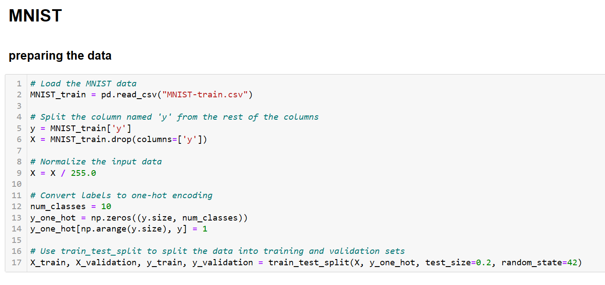
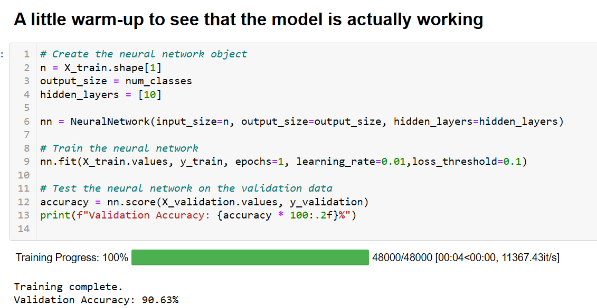
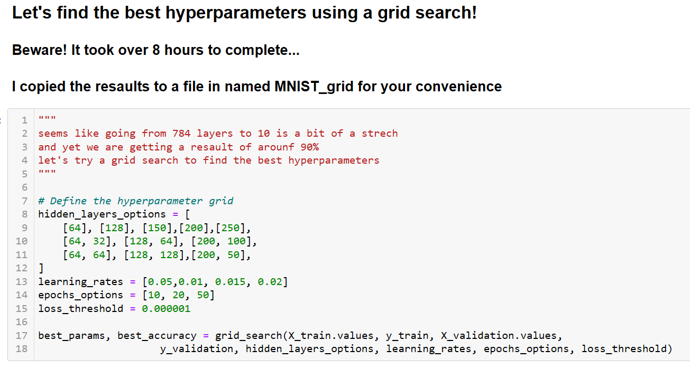
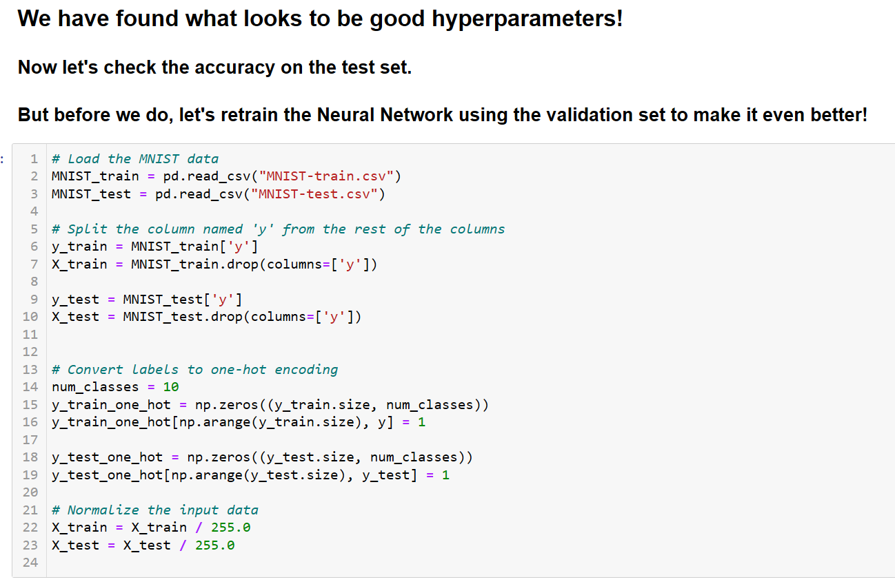
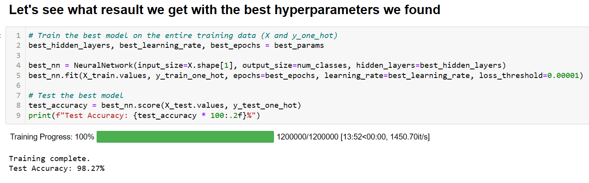

# Neural Network from Scratch

*Note: To open this link in a new tab without leaving this page, you can right-click it and select "Open link in new tab," or hold down `Ctrl` (or `Cmd` on Mac) while clicking.*

## Table of Contents
- [Introduction](#introduction)
- [Features](#features)
- [Installation](#installation)
- [Usage](#usage)
- [Screenshots](#screenshots)
- [License](#license)
- [Contact](#contact)

## Introduction

Welcome to the **Neural Network from Scratch** project! This repository features a fully-connected neural network implemented entirely in Python, designed to classify handwritten digits from the MNIST dataset. By building all components from the ground up, this project emphasizes a deep understanding of neural network fundamentals without relying on external libraries like TensorFlow or PyTorch.

Trained and tested using pre-processed CSV files to focus on the training process, the model achieves a high accuracy of around **98-99%** on the test set. The training data consists of **60,000 rows and 785 columns**, totaling **47,100,000 cells**. The project includes hyperparameter tuning via grid search over a validation set before evaluating the model on unseen data.

## Features

- **Neural Network from Scratch**: Implementation of a fully-connected neural network without using external deep learning libraries.
- **MNIST Classification**: Trains and tests on the MNIST dataset of handwritten digits.
- **Hyperparameter Tuning**: Includes a grid search over various hyperparameters (such as hidden layer sizes, learning rates, and epochs) to find the best model configuration.
- **Efficient Training**: Uses a validation set to select optimal hyperparameters and then retrains the model on the entire training set for better performance.
- **Large Dataset Handling**: Works with large CSV files (training set has 60,000 rows and 785 columns, totaling 47,100,000 cells).
- **Run on Google Colab**: You can run this code directly in Google Colab without downloading or installing anything on your system.
- **Detailed Documentation**: Provides step-by-step explanations in the accompanying Jupyter Notebook to help understand the training process and the neural network implementation.
- **Data Files Provided**: Links to the pre-processed CSV files are provided for convenience.

## Usage

### Running on Google Colab

You can run this project without any installation by using Google Colab:

1. Click on the "Open In Colab" badge at the top of this README or clicker here  

2. The Jupyter Notebook will open in Google Colab, where you can run the code cells directly.

3. **All necessary dependencies are pre-installed in the Google Colab environment.**

### Running Locally

If you prefer to run the code on your local machine, you will need to meet the following prerequisites.

#### Prerequisites

- **Python 3.7 or higher**: [Download Python](https://www.python.org/downloads/)
- **Git**: [Install Git](https://git-scm.com/downloads)
- **Jupyter Notebook**: Install via pip or conda.
- **NumPy** and **Pandas**: Install via pip if not already installed (`pip install numpy pandas`).
- **tqdm**: For progress bars during training (`pip install tqdm`).
- **gdown**: For downloading files from Google Drive (`pip install gdown`).

#### Download the Data Files

The project uses pre-processed MNIST data in CSV format to focus on the neural network training. The CSV files are large (the training set has 60,000 rows and 785 columns, totaling 47,100,000 cells).

Download the data files directly to your computer using the following links (not required):

*Note: To open this link in a new tab without leaving this page, you can right-click it and select "Open link in new tab," or hold down `Ctrl` (or `Cmd` on Mac) while clicking.*

- **Training Data**: [Download MNIST-train.csv](https://drive.google.com/uc?export=download&id=1I85Rsx7rN-iAqDlg4esurDoWeogwrF-N)
- **Test Data**: [Download MNIST-test.csv](https://drive.google.com/uc?export=download&id=1qPomi9_mzL51lZrheAvZjfn_ECJtlvyC)

### Notes on Hyperparameter Tuning

- **Grid Search**: The grid search for hyperparameter tuning can take a significant amount of time (over 8 hours) due to the exhaustive search over multiple configurations.
- **Pre-defined Best Parameters**: To save time, the best hyperparameters found during the grid search are hard-coded into the notebook.
- **Optional Grid Search**: There is no need to run the grid search again unless you wish to explore different configurations.

## Screenshots

### Data Preparation

*Preparing the MNIST data from CSV files.*

### Warm-up Training

*A quick warm-up to ensure the model is functioning properly.*

### Hyperparameter Grid Search

*Performing grid search to find the best hyperparameters (this can take a long time).*

### Retraining with Validation

*Retraining the model with the validation set for improved performance.*

### Best Hyperparameters

*The best hyperparameters found during the grid search.*

## License

This project is licensed under the MIT License - see the [LICENSE](LICENSE) file for details.

## Contact

For any questions or suggestions, feel free to contact:

- **Name**: Omer Blau
- **GitHub**: [github.com/omerblau](https://github.com/omerblau)

